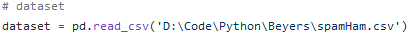
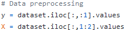
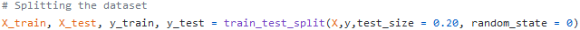
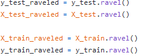

# Beyers
## Made by Team Team (Nikolai Christiansen, Mikkel Ertbjerg, Nikolaj Dyring)
---
## Train a machine learning model to be able to recognise spam in text messages

First we create a dataset out of the csv file provided  
  

Processing data for later use  
  

Splitting the dataset to create training  
  

Converting our arrays into lists as we need lists later on  
  

We chose Method A  


```py
# Computing the IDFs
tfidf_transformer = TfidfTransformer(smooth_idf=True,use_idf=True)
tfidf_transformer.fit(word_count)

# Visualizing the IDF's weights.
df_wrd = pd.DataFrame(tfidf_transformer.idf_, index=cv.get_feature_names(),columns=["idf_weights"])
df_wrd.sort_values(by=['idf_weights'])


# count matrix
count_vector=cv.transform(X_train_raveled)
count_vector

# tf-idf scores
tf_idf_vector=tfidf_transformer.transform(count_vector)
tf_idf_vector


# compute TDIDF score per document
feature_names = cv.get_feature_names()
 
# get tfidf vector for the first document
first_document_vector = tf_idf_vector[0]
first_document_vector

# print the scores
df_doc = pd.DataFrame(first_document_vector.T.todense(), index=feature_names, columns=["tfidf"])
df_doc.sort_values(by=["tfidf"],ascending=False)

# we choose multinomial Naive Bayes 
classifier = MultinomialNB()

# connect the vectorizer to the multinomial classifier
model = make_pipeline(cv, classifier)

model.fit(X_train_raveled, y_train_raveled)

# use the trained model to predict categories for the test data
y_predicted = model.predict(X_test_raveled)

model_score = model.score(X_train_raveled, y_train_raveled)

# Compare the accuracy between the predicted and test data.
accuracy = accuracy_score(y_test_raveled, y_predicted)
accuracy

# saving the confusion matrix
cmat = confusion_matrix(y_test_raveled, y_predicted)
cmat

target_names_x = ['ham','spam']
target_names_y = ['spam', 'ham']

# Generate a heatmap
sns.set()
sns.heatmap(cmat.T, square=True, annot=True, fmt='d', cbar=False,
            xticklabels=target_names_x, yticklabels=target_names_y)
plt.xlabel('actual')
plt.ylabel('predicted');
plt.show()
```
